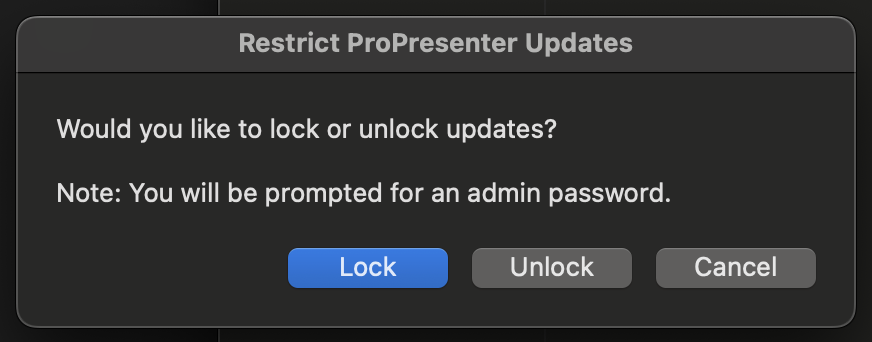
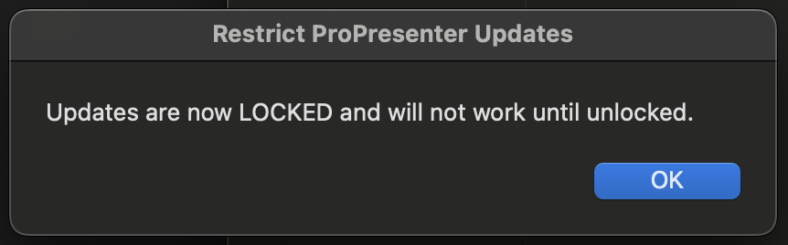
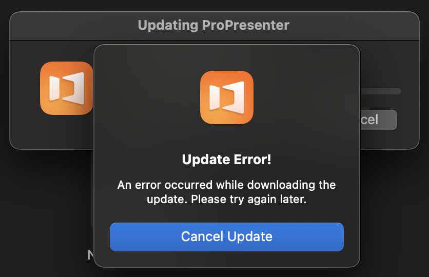

# Restrict ProPresenter Updates
A small open-source macOS app that allows you to block ProPresenter from being accidentally updated by volunteers.

## Installation
You can download the application from the [Releases](https://github.com/mvanderlinde/RestrictProPresenterUpdates/releases) page.

## Screenshots

